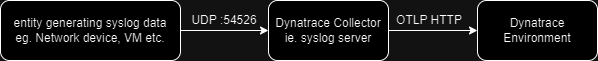

# Dynatrace Observability Lab: Syslog Ingest

--8<-- "snippets/disclaimer.md"
--8<-- "snippets/view-code.md"

This hands on Observability Lab will show how to ingest syslog log data into Dynatrace via the [Dynatrace collector](https://docs.dynatrace.com/docs/extend-dynatrace/opentelemetry/collector){target=_blank}.

## Compatibility

| Deployment         | Tutorial Compatible |
|--------------------|---------------------|
| Dynatrace Managed  | ✔️                 |
| Dynatrace SaaS     | ✔️                 |

## Syslog via ActiveGate

If you already have an ActiveGate deployed and / or prefer to use an ActiveGate for syslog ingest, [follow these instructions instead](https://docs.dynatrace.com/docs/observe-and-explore/logs/lma-log-ingestion/lma-log-investion-syslog){target=_blank}. Whether the OpenTelemetry collector or ActiveGate is used, the end result is the same.

- [Click here to begin :octicons-arrow-right-24:](getting-started.md)

