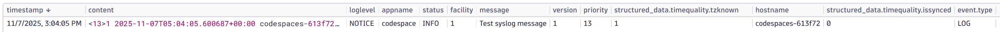
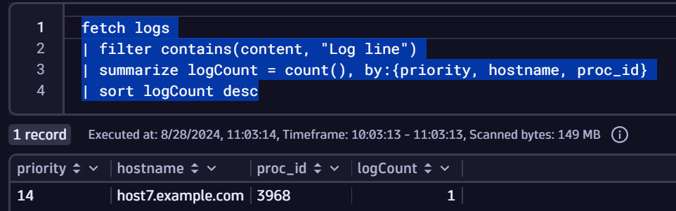

It is time to view the data in Dynatrace.

--8<-- "snippets/bizevent-view-data.js"

In Dynatrace:

* Press `ctrl + k` search for `notebooks`
* Add a new section for `logs`
* Search for:

```{ "name": "fetch log line" }
fetch logs
| search "syslog"
```




These fields can be used to filter, group or parse log data further.

For example, the following query shows all log lines containing the text `syslog` split by the `priority`, `version`, `hostname` and `loglevel` and `message` fields:

```
fetch logs
| filter contains(content, "Log line")
| summarize logCount = count(), by:{priority, version, hostname, loglevel, message}
| sort logCount desc
```



## Congratulations

You have succesfully ingested syslog data into Dynatrace.

This Observability lab is now complete.

<div class="grid cards" markdown>
- [Click here to cleanup your environment :octicons-arrow-right-24:](cleanup.md)
</div>
